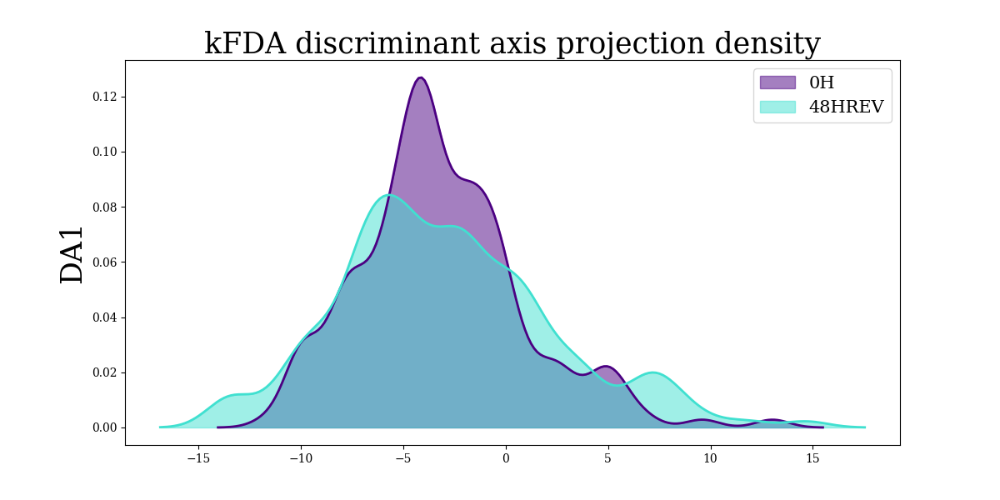
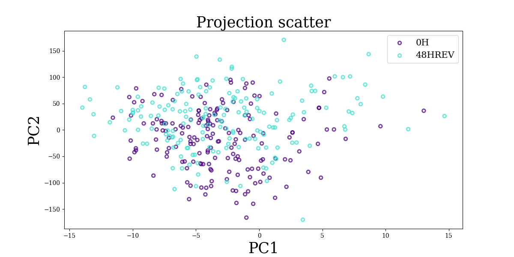
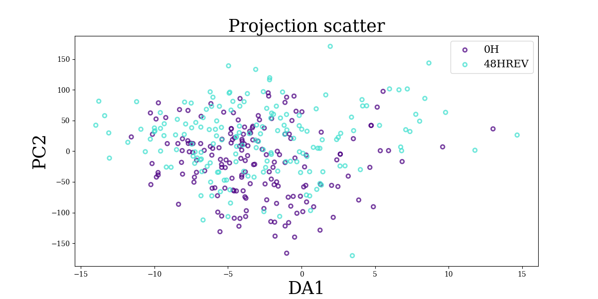

<!-- README.md is generated from README.Rmd. Please edit that file -->

# ktest R package

<!-- badges: start -->
<!-- badges: end -->

Kernel based statistical testing

> :warning: To install and configure the `ktest` R package, see the
> “Installation and configuration” section
> [below](#installation-and-configuration). :warning:

# Using ktest

The `ktest` package implements kernel-based statistical testing, such as
maximal mean discrepancy test (MMD) and a test based on kernel Fisher
Discriminant Analysis (kFDA). It can be used for differential expression
analysis in transcriptomics data for instance.

See Ozier-Lafontaine et al (2024) for more details.

## Tutorial requirements

We load the packages required for this tutorial:

``` r
library(conflicted)     # manage namespace conflict between packages
library(reticulate)     # manage Python dependencies
library(tibble)         # manage data.frame
```

## Getting started

> :warning: For package installation and setup, including Python
> environment configuration, see the dedicated vignette
> `vignette("install_ktest", package = "ktest")`. :warning:

We load the `ktest` package and the configured Python environment:

``` r
library(ktest)
reticulate::use_virtualenv(virtualenv = "ktest", required = TRUE)
```

We check that it is working:

``` r
check_ktest()
#> 'ktest' is ready.
#> [1] TRUE
```

## Data import

``` r
# data loading
tmp <- load_example_data()
#> New names:
#> New names:
#> • `` -> `...1`
# gene expression data table (344 cells and 83 genes)
data_tab <- tmp$data_tab
# metadata table with sampling conditions (for the 344 cells)
metadata_tab <- tmp$metadata_tab
```

This dataset originates from a study that investigated the molecular
mechanisms underlying cell differentiation and reversion, by measuring
cell transcriptomes at four time points: undifferentiated T2EC
maintained in a self-renewal medium (condition `"0H"`), then put in a
differentiation-inducing medium for 24h (condition `"24H"`). This
population was then split into a first population maintained in the same
medium for another 24h to achieve differentiation (condition
`"48HDIFF"`), and the second population was put back in the self-renewal
medium to investigate potential reversion (condition `"48HREV"`). Cell
transcriptomes were measured using scRT-qPCR on 83 genes selected to be
involved in the differentiation process.

See Zreika et al (2022) and Ozier-Lafontaine et al (2024) for more
details.

The example dataset contains the samples for the condition `"0H"` and
`"48HREV"`.

> See <https://github.com/LMJL-Alea/ktest/tree/main/tutorials/v5_data>
> for the full dataset with all conditions or the detailed section
> [below](#single-cell-transcriptomic-full-dataset).

## Kernel-based two sample test

First we initialize a `ktest` object with following input parameters:

- `data`: a data table of observations in rows and features in columns
  (cells in rows and gene expression in columns in this example).
- `metadata`: a single column data table with the sample label for each
  observations.
- `sample_names`: a vector giving the two labels that will be used for
  the two sample comparison (among the possible labels in `metadata`).

``` r
kt_1 = ktest_init(
    data = data_tab, metadata = metadata_tab, 
    sample_names = c('0H','48HREV')
)
```

Then we run the test using the following input parameters:

- `kt`: the ktest object that was previously initialized.
- `stat`: the test to implement, `"kfda"` for kernel-FDA-based test and
  `"mmd"` for MMD-based test.
- `permutation`: to indicate if p-values will be computed using a
  permutation-based approach in addition to the asymptotically derived
  p-values for kFDA testing (MMD testing always uses permutation-based
  p-value computation).
- `n_permutation`: number of permutation to consider for
  permutation-based p-value computation.

> **Note:** this function does not return any value, it updates the
> input ktest object.

Here without permutation:

``` r
test(
    kt = kt_1, 
    stat = 'kfda', 
    permutation = FALSE, 
    verbose = 1
)
#> - Computing kFDA statistic
#> - Computing asymptotic p-values
```

Here[^1] with permutation:

``` r
test(
    kt = kt_1, 
    stat = 'kfda', 
    permutation = TRUE, 
    n_permutations = 500, 
    verbose = 1
)
#> - Computing kFDA statistic
#> - Performing permutations to compute p-values:
```

We can print the results:

``` r
print(kt_1)
#> An object of class Ktest.
#> 83 features across 344 observations
#> Comparison: 0H (173 observations) and 48HREV (171 observations).
#> ___Multivariate test results___
#> MMD:
#> not computed, run ktest.test.
#> kFDA:
#> Truncation 1: 0.25768122893254786. P-value:
#> asymptotic: 0.6117176755322093, permutation: 0.576.
#> Truncation 2: 36.65831702676734. P-value:
#> asymptotic: 1.0958411375934492e-08, permutation: 0.0.
#> Truncation 3: 74.86728462307967. P-value:
#> asymptotic: 3.8685719368137556e-16, permutation: 0.0.
#> Truncation 4: 111.77209285817722. P-value:
#> asymptotic: 3.047924268172892e-23, permutation: 0.0.
#> Truncation 5: 120.74602538674806. P-value:
#> asymptotic: 2.181256318092915e-24, permutation: 0.0.
```

### Extract statistics

We can extract the test statistics for kFDA (`stat = 'kfda'`) or MMD
(stat = ‘mmd’\`):

``` r
get_statistics(kt_1, stat = 'kfda', contrib = FALSE, t_max = 50)
#>           1           2           3           4           5           6 
#>   0.2576812  36.6583170  74.8672846 111.7720929 120.7460254 126.4390202 
#>           7           8           9          10          11          12 
#> 126.5761190 127.0480822 127.1302889 130.4058893 131.4395665 139.9422136 
#>          13          14          15          16          17          18 
#> 152.6610851 153.7023419 153.7349078 154.6052119 160.2342769 161.1602776 
#>          19          20          21          22          23          24 
#> 166.6401095 168.4681932 169.0263149 176.8598037 182.8506798 208.1064807 
#>          25          26          27          28          29          30 
#> 209.1857589 209.7949791 209.7961977 246.6842350 250.2489963 251.0360613 
#>          31          32          33          34          35          36 
#> 253.5617838 257.8182001 258.6969020 318.1404698 318.1853513 323.3736594 
#>          37          38          39          40          41          42 
#> 323.4449691 329.3598766 329.4283957 335.3213748 335.7356350 338.2821328 
#>          43          44          45          46          47          48 
#> 338.2852147 338.4339921 342.9890795 343.1930595 343.1931877 356.9054618 
#>          49          50 
#> 357.5857633 357.6056779
```

> **Note:** for kFDA, we can extract the cumulative statistic value
> along the embedding projection dimensions (with `contrib = FALSE`) or
> the contribution of each dimension to the statistic value along the
> embedding projection dimensions (with `contrib = TRUE`).

### Extract p-values

We can choose which p-values to extract, for kFDA (permutation-based or
asymptotic) or MMD (permutation-based) test:

``` r
get_pvalues(kt_1, stat = 'kfda', permutation = FALSE, t_max = 50)
#>            1            2            3            4            5            6 
#> 6.117177e-01 1.095841e-08 3.868572e-16 3.047924e-23 2.181256e-24 7.219795e-25 
#>            7            8            9           10           11           12 
#> 3.260563e-24 1.156615e-23 4.611268e-23 3.860337e-23 8.898916e-23 6.152441e-24 
#>           13           14           15           16           17           18 
#> 5.993821e-26 1.304160e-25 4.364155e-25 9.626304e-25 2.390025e-25 4.938151e-25 
#>           19           20           21           22           23           24 
#> 1.289465e-25 1.720393e-25 3.971201e-25 3.573069e-26 7.285468e-27 2.798294e-31 
#>           25           26           27           28           29           30 
#> 5.175632e-31 1.160420e-30 3.344107e-30 7.435028e-37 4.559285e-37 9.562493e-37 
#>           31           32           33           34           35           36 
#> 9.150847e-37 4.040883e-37 7.883852e-37 7.365180e-48 2.232091e-47 6.677301e-48 
#>           37           38           39           40           41           42 
#> 1.958790e-47 4.202573e-48 1.212181e-47 2.611290e-48 6.355529e-48 5.971620e-48 
#>           43           44           45           46           47           48 
#> 1.708242e-47 4.530116e-47 1.729527e-47 4.407183e-47 1.214308e-46 8.531403e-49 
#>           49           50 
#> 1.745468e-48 4.713689e-48
```

> **Note:** for kFDA, we can extract the cumulative statistic values
> along the embedding projection dimensions (with `contrib = FALSE`) or
> the contribution of each dimension to the statistic values along the
> embedding projection dimensions (with `contrib = TRUE`).

### Extract projections

For kernel FDA (kfda), we can get the kernel embedding projections for
each sample condition with respect to the a given truncation value:

``` r
proj <- get_proj(kt_1, contrib = FALSE, t_max = 50)
names(proj)
#> [1] "0H"     "48HREV"
as_tibble(proj[[1]])
#> # A tibble: 173 × 50
#>      `1`    `2`    `3`    `4`    `5`    `6`    `7`    `8`    `9`   `10`   `11`
#>    <dbl>  <dbl>  <dbl>  <dbl>  <dbl>  <dbl>  <dbl>  <dbl>  <dbl>  <dbl>  <dbl>
#>  1 -2.48  -55.8 -171.  -218.  -213.  -219.  -227.  -243.  -249.  -242.  -244. 
#>  2 -3.78  -80.4 -121.  -103.  -136.  -172.  -185.  -197.  -201.  -196.  -214. 
#>  3 -6.83   49.9  124.   -47.3  -36.2  -26.1  -30.3  -44.2  -47.9  -33.3  -34.0
#>  4 -8.30   59.5   40.1 -104.   -96.6  -70.4  -77.6  -76.6  -84.4  -79.3  -83.2
#>  5 -2.09 -117.  -131.  -369.  -366.  -394.  -399.  -391.  -397.  -376.  -357. 
#>  6  1.26 -127.  -125.  -176.  -210.  -182.  -192.  -196.  -198.  -197.  -198. 
#>  7 -1.86  -56.4  -17.9  -27.0  -47.1  -16.0  -27.5  -40.6  -43.6  -32.0  -39.7
#>  8 -4.82   23.8  -51.1 -139.   -83.9  -46.7  -53.7  -48.0  -54.7  -63.2  -67.6
#>  9 -5.71  -78.3 -169.  -217.  -217.  -247.  -257.  -270.  -277.  -264.  -270. 
#> 10  9.60   16.6  -16.2   56.4   40.1   76.7   69.8   70.0   70.4   79.3   70.7
#> # ℹ 163 more rows
#> # ℹ 39 more variables: `12` <dbl>, `13` <dbl>, `14` <dbl>, `15` <dbl>,
#> #   `16` <dbl>, `17` <dbl>, `18` <dbl>, `19` <dbl>, `20` <dbl>, `21` <dbl>,
#> #   `22` <dbl>, `23` <dbl>, `24` <dbl>, `25` <dbl>, `26` <dbl>, `27` <dbl>,
#> #   `28` <dbl>, `29` <dbl>, `30` <dbl>, `31` <dbl>, `32` <dbl>, `33` <dbl>,
#> #   `34` <dbl>, `35` <dbl>, `36` <dbl>, `37` <dbl>, `38` <dbl>, `39` <dbl>,
#> #   `40` <dbl>, `41` <dbl>, `42` <dbl>, `43` <dbl>, `44` <dbl>, `45` <dbl>, …
as_tibble(proj[[2]])
#> # A tibble: 171 × 50
#>        `1`   `2`     `3`     `4`     `5`    `6`    `7`    `8`    `9`    `10`
#>      <dbl> <dbl>   <dbl>   <dbl>   <dbl>  <dbl>  <dbl>  <dbl>  <dbl>   <dbl>
#>  1   9.80   73.0    5.70   31.4    15.6    29.6   30.3   16.6   11.4    8.20
#>  2  -6.42  -31.1   14.6    31.3    35.5    44.2   37.5   33.5   26.7    6.19
#>  3   0.552 -32.8    9.09 -117.    -69.0   -61.9  -70.1  -84.0  -92.5  -74.3 
#>  4 -13.1    16.6   40.7     8.31    2.40   51.4   47.6   39.7   35.3   43.0 
#>  5   1.41   20.0  194.    117.    150.    161.   151.   146.   148.   182.  
#>  6  -2.37   67.4  223.    223.    220.    271.   263.   277.   273.   288.  
#>  7  -3.06   39.5  147.     49.6    79.1    84.2   76.5   69.0   65.3   63.1 
#>  8  -7.95   72.0  240.    156.    207.    234.   233.   228.   222.   220.  
#>  9   1.45  -32.1 -113.   -186.   -120.   -130.  -134.  -142.  -149.  -173.  
#> 10  -9.97   23.2   84.3    86.3   118.    178.   169.   168.   164.   175.  
#> # ℹ 161 more rows
#> # ℹ 40 more variables: `11` <dbl>, `12` <dbl>, `13` <dbl>, `14` <dbl>,
#> #   `15` <dbl>, `16` <dbl>, `17` <dbl>, `18` <dbl>, `19` <dbl>, `20` <dbl>,
#> #   `21` <dbl>, `22` <dbl>, `23` <dbl>, `24` <dbl>, `25` <dbl>, `26` <dbl>,
#> #   `27` <dbl>, `28` <dbl>, `29` <dbl>, `30` <dbl>, `31` <dbl>, `32` <dbl>,
#> #   `33` <dbl>, `34` <dbl>, `35` <dbl>, `36` <dbl>, `37` <dbl>, `38` <dbl>,
#> #   `39` <dbl>, `40` <dbl>, `41` <dbl>, `42` <dbl>, `43` <dbl>, `44` <dbl>, …
```

And we can also get the corresponding contributions to the kernel
embedding projections for each sample condition (using
`contrib = TRUE`):

``` r
proj_contrib <- get_proj(kt_1, contrib = TRUE, t_max = 50)
names(proj_contrib)
#> [1] "0H"     "48HREV"
as_tibble(proj_contrib[[1]])
#> # A tibble: 173 × 50
#>      `1`     `2`     `3`     `4`     `5`    `6`    `7`     `8`    `9`  `10`
#>    <dbl>   <dbl>   <dbl>   <dbl>   <dbl>  <dbl>  <dbl>   <dbl>  <dbl> <dbl>
#>  1 -2.48  -53.3  -116.    -46.8    5.21   -5.75  -8.04 -16.5   -5.99   7.00
#>  2 -3.78  -76.6   -40.2    18.0  -33.6   -35.8  -13.4  -11.7   -4.39   5.64
#>  3 -6.83   56.7    74.1  -171.    11.2    10.0   -4.18 -13.9   -3.64  14.6 
#>  4 -8.30   67.8   -19.4  -145.     7.86   26.2   -7.18   0.969 -7.75   5.11
#>  5 -2.09 -115.    -14.5  -237.     2.42  -27.2   -5.70   8.47  -5.77  20.2 
#>  6  1.26 -129.      2.06  -50.7  -33.8    27.8  -10.2   -3.81  -2.45   1.32
#>  7 -1.86  -54.6    38.5    -9.04 -20.1    31.1  -11.6  -13.1   -2.96  11.6 
#>  8 -4.82   28.6   -74.9   -88.2   55.4    37.2   -6.98   5.70  -6.72  -8.41
#>  9 -5.71  -72.6   -90.3   -48.5    0.203 -29.7  -10.6  -12.4   -7.03  12.6 
#> 10  9.60    7.04  -32.9    72.7  -16.3    36.6   -6.87   0.126  0.442  8.92
#> # ℹ 163 more rows
#> # ℹ 40 more variables: `11` <dbl>, `12` <dbl>, `13` <dbl>, `14` <dbl>,
#> #   `15` <dbl>, `16` <dbl>, `17` <dbl>, `18` <dbl>, `19` <dbl>, `20` <dbl>,
#> #   `21` <dbl>, `22` <dbl>, `23` <dbl>, `24` <dbl>, `25` <dbl>, `26` <dbl>,
#> #   `27` <dbl>, `28` <dbl>, `29` <dbl>, `30` <dbl>, `31` <dbl>, `32` <dbl>,
#> #   `33` <dbl>, `34` <dbl>, `35` <dbl>, `36` <dbl>, `37` <dbl>, `38` <dbl>,
#> #   `39` <dbl>, `40` <dbl>, `41` <dbl>, `42` <dbl>, `43` <dbl>, `44` <dbl>, …
as_tibble(proj_contrib[[2]])
#> # A tibble: 171 × 50
#>        `1`   `2`   `3`      `4`    `5`    `6`     `7`    `8`   `9`   `10`
#>      <dbl> <dbl> <dbl>    <dbl>  <dbl>  <dbl>   <dbl>  <dbl> <dbl>  <dbl>
#>  1   9.80   63.2 -67.3   25.7   -15.9   14.1    0.722 -13.8  -5.19  -3.18
#>  2  -6.42  -24.7  45.7   16.7     4.20   8.72  -6.73   -3.95 -6.85 -20.5 
#>  3   0.552 -33.4  41.9 -126.     48.3    7.09  -8.18  -13.9  -8.50  18.2 
#>  4 -13.1    29.7  24.1  -32.4    -5.90  49.0   -3.78   -7.87 -4.42   7.73
#>  5   1.41   18.6 174.   -76.9    32.6   11.0  -10.0    -4.47  1.28  33.9 
#>  6  -2.37   69.8 156.     0.297  -3.12  50.4   -7.97   13.9  -3.56  15.2 
#>  7  -3.06   42.6 107.   -97.4    29.5    5.07  -7.66   -7.50 -3.76  -2.18
#>  8  -7.95   80.0 168.   -83.1    50.5   27.5   -1.30   -5.15 -6.40  -1.36
#>  9   1.45  -33.6 -80.5  -73.7    66.1  -10.2   -3.04   -8.70 -6.92 -24.3 
#> 10  -9.97   33.2  61.1    2.00   31.3   60.8   -9.67   -1.11 -3.91  11.5 
#> # ℹ 161 more rows
#> # ℹ 40 more variables: `11` <dbl>, `12` <dbl>, `13` <dbl>, `14` <dbl>,
#> #   `15` <dbl>, `16` <dbl>, `17` <dbl>, `18` <dbl>, `19` <dbl>, `20` <dbl>,
#> #   `21` <dbl>, `22` <dbl>, `23` <dbl>, `24` <dbl>, `25` <dbl>, `26` <dbl>,
#> #   `27` <dbl>, `28` <dbl>, `29` <dbl>, `30` <dbl>, `31` <dbl>, `32` <dbl>,
#> #   `33` <dbl>, `34` <dbl>, `35` <dbl>, `36` <dbl>, `37` <dbl>, `38` <dbl>,
#> #   `39` <dbl>, `40` <dbl>, `41` <dbl>, `42` <dbl>, `43` <dbl>, `44` <dbl>, …
```

## Note for Python users

If you are used to using the `ktest` Python package, you can do pretty
much the same things in R thanks to `reticulate` using a `$` character
instead of a `.` character to access the `Ktest` class attributes and
member functions, e.g.:

``` r
# run test
kt_1$test(permutation = TRUE, n_permutation = 1000L)
# get statistic value
kt_1$kfda_statistic
# get p-values (asymptotic and permutation-based)
kt_1$kfda_pval_asymp
kt_1$kfda_pval_perm
# compute kernel embedding projection
kt_1$project()
# get projections
kt_1$kfda_proj
# get contribution for projections
kt_1$kfda_proj_contrib
```

> **Note**: you can refer to this [notebook
> tutorial](https://github.com/LMJL-Alea/ktest/blob/main/tutorials/demo_ktest.ipynb)
> to discover more about the `ktest` Python package.

## Figures

At the moment, plot generation to illustrate `ktest` results can be done
using the `ktest` Python package plot generation (with a trick importing
`matplotlib` Python package for figure generation using `reticulate`).

> **Note**: this plot generation system may not work as expected with
> Rmarkdown rendering or in console mode or in Rstudio. In that case,
> saving the figure should still work.

``` r
# import matplotlib.pyplot
plt <- reticulate::import("matplotlib.pyplot")
```

You can plot a density of the projection on either the discriminant axes
of the kFDA statistic:

``` r
fig <- kt_1$plot_density(t = 1L)
```

See
[here](https://github.com/LMJL-Alea/ktest/blob/main/python/src/ktest/tester.py#L416)
for the `plot_density()` method arguments.

``` r
# plot figure (may not work as expected)
fig[[1]]
fig[[2]]
plt$show()
```

``` r
# save the figure
fig[[1]]
fig[[2]]
plt$savefig("density_plot.png")
```



You can also do a scatter plot of the kernel embedding projections or of
the kernel embedding projection contributions:

``` r
fig <- kt_1$scatter_projection(t_x = 1L, t_y = 2L, proj_xy = c('kfda_contrib', 'kfda_contrib'))
```

See
[here](https://github.com/LMJL-Alea/ktest/blob/main/python/src/ktest/tester.py#L486)
for the `scatter_projection()` method arguments.

``` r
# plot figure (may not work as expected)
fig[[1]]
fig[[2]]
plt$show()
```

``` r
# save the figure
fig[[1]]
fig[[2]]
plt$savefig("projection_scatterplot.png")
```



``` r
fig <- kt_1$scatter_projection(t_x = 1L, t_y = 1L, proj_xy = c('kfda', 'kfda_contrib'))
```

``` r
# plot figure (may not work)
fig[[1]]
fig[[2]]
plt$show()
```

``` r
# save the figure
fig[[1]]
fig[[2]]
plt$savefig("projection_contrib_scatterplot.png")
```



## Single-cell transcriptomic full dataset

Here are the line to download and preprocess the full single-cell
transcriptomic full dataset used in Ozier-Lafontaine et al (2024).

``` r
# requirements
library(dplyr)
library(readr)
library(stringr)
library(tibble)

# download dataset
data_tab <- readr::read_csv(
    "https://raw.githubusercontent.com/LMJL-Alea/ktest/main/tutorials/v5_data/RTqPCR_reversion_logcentered.csv",
    show_col_types = FALSE
)
#> New names:
#> • `` -> `...1`

# extract sample condition
metadata_tab <- data_tab %>% pull(1) %>% 
    str_split(pattern = "\\.", simplify = TRUE) %>%
    as_tibble(.name_repair = "universal") %>% select(2) %>% 
    rename_with(~c("condition"))
#> New names:
#> • `` -> `...1`
#> • `` -> `...2`
#> • `` -> `...3`

# drop sample condition from gene expression table
data_tab <- data_tab %>% select(!1)

# data dimension (cells x genes)
dim(data_tab)
#> [1] 685  83

# detail sample conditions
table(metadata_tab)
#> condition
#>      0H     24H 48HDIFF  48HREV 
#>     173     173     168     171
```

## References

Ozier-Lafontaine A., Fourneaux C., Durif G., Arsenteva P., Vallot C.,
Gandrillon O., Gonin-Giraud S., Michel B., Picard F. (2024).
Kernel-Based Testing for Single-Cell Differential Analysis. Preprint.
[doi:10.48550/arXiv.2307.08509](https://dx.doi.org/10.48550/arXiv.2307.08509);
[arXiv.2307.08509](https://arxiv.org/abs/2307.08509);
[hal-04214858](https://hal.science/hal-04214858).

Zreika S., Fourneaux C., Vallin E., Modolo L., Seraphin R., Moussy A.,
Ventre E., Bouvier M., Ozier-Lafontaine A., Bonnaffoux A., Picard F.,
Gandrillon O., Gonin-Giraud S. (2022 Jul 6). Evidence for close
molecular proximity between reverting and undifferentiated cells. BMC
Biol. 20(1):155.
[doi:10.1186/s12915-022-01363-7](https://dx.doi.org/10.1186/s12915-022-01363-7);
[PMID: 35794592](https://pubmed.ncbi.nlm.nih.gov/35794592/); [PMCID:
PMC9258043](https://www.ncbi.nlm.nih.gov/pmc/articles/PMC9258043/);
[hal-04134084v1](https://hal.science/hal-04134084v1).

---

# Installation and configuration

``` r
knitr::opts_chunk$set(eval = TRUE)
```

## Package requirements

- R version 4+
- Python version 3+

**Important:** Python is a requirement as an intern machinery for the
package to work but you will not need to create nor manipulate Python
codes to use the `ktest` R package.

> **Note:** if you don’t have Python on your system: when configuring
> the `ktest` R package (c.f. [below](#first-time-configuration)), the
> `reticulate` R package will offer to install Python on your system.

The `ktest` R package is using the `ktest` Python package under the hood
thanks to the
[`reticulate`](https://CRAN.R-project.org/package=reticulate) R package
that provides an “R Interface to Python”.

## Installation

You can install the development version of `ktest` with the following
commands:

``` r
install.package("remotes")
remotes::install_github("LMJL-Alea/ktest", ref = "main", subdir = "r-pkg")
```

> **Note:** `ktest` is not available on CRAN at the moment but will be
> shortly.

## First-time configuration

After installing the `ktest` R package, you need to run the following
commands (**once**) to complete the setup (and install the `ktest`
Python package on your system):

> :warning: To avoid messing with your Python system or user
> environment, we recommend to use a dedicated Python environment for
> `ktest` (c.f. [next section](#using-a-python-environment)) :warning:

``` r
# load ktest R package
library(ktest)
# install ktest package python requirements
install_ktest()
# check ktest configuration
check_ktest()
```

### Using a Python environment

Here are the commands to be run (once) to configure the `ktest` package
using a dedicated Python **virtual environment**:

``` r
# load ktest R package
library(ktest)
# create dedicated Python virtual environment
reticulate::virtualenv_create("ktest")
# activate the python environment
reticulate::use_virtualenv(virtualenv = "ktest", required = TRUE)
# verify python version
reticulate::py_config()
# install ktest package python requirements
install_ktest(method = "virtualenv", envname = "ktest")
# check ktest configuration
check_ktest()
```

> **Note:** if you are a Miniconda/Anaconda Python distribution user,
> you can either user a Python virtual environment (c.f. above) or a
> **Conda environment** with the same results. Please refer to the
> `reticulate`
> [documentation](https://rstudio.github.io/reticulate/articles/versions.html#providing-hints)
> in this case.

### Managing Python

To check which **version of Python** you are using through `reticulate`,
you can run:

``` r
reticulate::py_discover_config()
```

> **Note:** To get more information about **managing** which **version
> of Python** you are using, you can refer to `reticulate`
> [documentation](https://rstudio.github.io/reticulate/articles/versions.html)
> about “Python Version Configuration”.

## Usage

Once the `ktest` package is installed and configured, to use it, you
only need to load it like any other R package:

``` r
library(ktest)
kt <- ktest(...) # see other vignettes
```

:warning: If you are using a **dedicated Python environment**, you also
need to load it every time before using `ktest`:

``` r
library(ktest)
reticulate::use_virtualenv(virtualenv = "ktest", required = TRUE)
kt <- ktest(...) # see other vignettes
```

[^1]: the previous result without permutation are not lost, the object
    is just updated with the new permutation-based result
