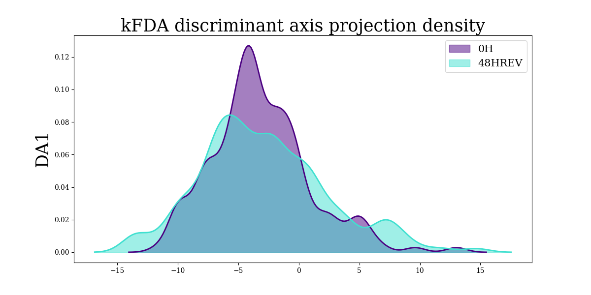
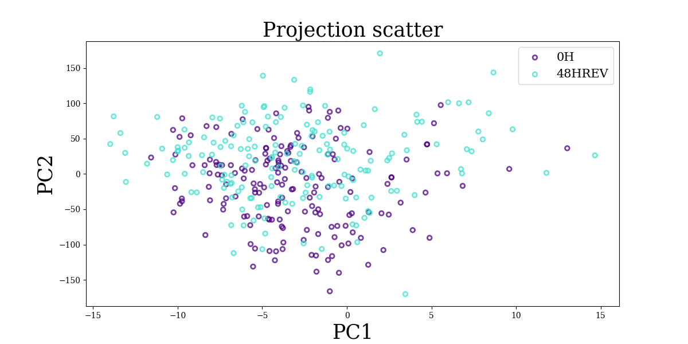
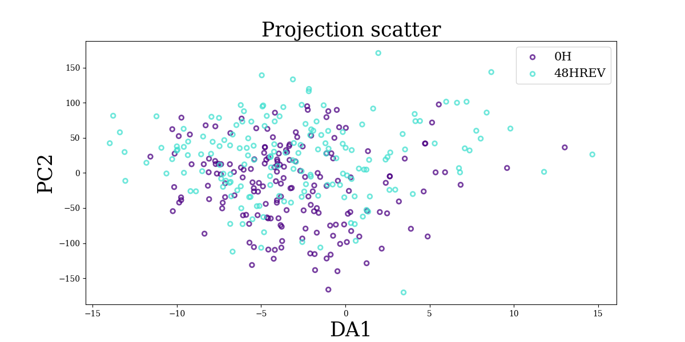

```{r knitr_setup, include = FALSE}
knitr::opts_chunk$set(
  collapse = TRUE,
  comment = "#>",
  progress = TRUE,
  message = TRUE,
  warning = TRUE,
  eval = TRUE,
  cache = TRUE
)
```

The `ktest` package implements kernel-based statistical testing, such as maximal mean discrepancy test (MMD) and a test based on kernel Fisher Discriminant Analysis (kFDA). It can be used for differential expression analysis in transcriptomics data for instance.

See Ozier-Lafontaine et al (2024) for more details.

## Tutorial requirements

```{r requirement_install, include=FALSE}
required <- c("conflicted", "reticulate", "tibble")
sapply(
    required,
    function(pkg) {
        if(! pkg %in% .packages(all.available = TRUE)) install.packages(pkg)
    }
)
```

```{r reticulate_knitr_config, include=FALSE}
knitr::knit_engines$set(python = reticulate::eng_python)
```

We load the packages required for this tutorial:
```{r requirements}
library(conflicted)     # manage namespace conflict between packages
library(reticulate)     # manage Python dependencies
library(tibble)         # manage data.frame
```

## Getting started

```{r package_install, include=FALSE}
# load ktest R package
library(ktest)
# create dedicated Python virtual environment
reticulate::virtualenv_create("ktest")
# activate the python environment
reticulate::use_virtualenv(virtualenv = "ktest", required = TRUE)
# verify python version
reticulate::py_config()
# install ktest package python requirements
install_ktest(method = "virtualenv", envname = "ktest")
```

> :warning: For package installation and setup, including Python environment configuration, see the dedicated vignette `vignette("install_ktest", package = "ktest")`. :warning:

We load the `ktest` package and the configured Python environment:

```{r setup}
library(ktest)
reticulate::use_virtualenv(virtualenv = "ktest", required = TRUE)
```

We check that it is working:
```{r check}
check_ktest()
```

## Data import

```{r}
# data loading
tmp <- load_example_data()
# gene expression data table (344 cells and 83 genes)
data_tab <- tmp$data_tab
# metadata table with sampling conditions (for the 344 cells)
metadata_tab <- tmp$metadata_tab
```

This dataset originates from a study that investigated the molecular mechanisms 
underlying cell differentiation and reversion, by measuring cell 
transcriptomes at four time points: undifferentiated T2EC maintained in a 
self-renewal medium (condition `"0H"`), then put in a differentiation-inducing 
medium for 24h (condition `"24H"`). This population was then split into 
a first population maintained in the same medium for another 24h to achieve 
differentiation (condition `"48HDIFF"`), and the second population was put 
back in the self-renewal medium to investigate potential reversion 
(condition `"48HREV"`). Cell transcriptomes were measured using 
scRT-qPCR on 83 genes selected to be involved in the differentiation 
process.

See Zreika et al (2022) and Ozier-Lafontaine et al (2024) for more details.

The example dataset contains the samples for the condition `"0H"` and 
`"48HREV"`.

See <https://github.com/LMJL-Alea/ktest/tree/main/tutorials/v5_data> for 
the entire dataset. 

## Kernel-based two sample test

First we initialize a `ktest` object with following input parameters:

- `data`: a data table of observations in rows and features in columns (cells in rows and gene expression in columns in this example).
- `metadata`: a single column data table with the sample label for each observations.
- `sample_names`: a vector giving the two labels that will be used for the two sample comparison (among the possible labels in `metadata`).

```{r}
kt_1 = ktest_init(
    data = data_tab, metadata = metadata_tab, 
    sample_names = c('0H','48HREV')
)
```

Then we run the test using the following input parameters:

- `kt`: the ktest object that was previously initialized.
- `stat`: the test to implement, `"kfda"` for kernel-FDA-based test and `"mmd"` for MMD-based test.
- `permutation`: to indicate if p-values will be computed using a permutation-based approach in addition to the asymptotically derived p-values for kFDA testing (MMD testing always uses permutation-based p-value computation).
- `n_permutation`: number of permutation to consider for permutation-based p-value computation.

> **Note:** this function does not return any value, it updates the input ktest object.

Here without permutation:
```{r}
test(
    kt = kt_1, 
    stat = 'kfda', 
    permutation = FALSE, 
    verbose = 1
)
```

Here^[the previous result without permutation are not lost, the object is just updated with the new permutation-based result] with permutation:
```{r}
test(
    kt = kt_1, 
    stat = 'kfda', 
    permutation = TRUE, 
    n_permutations = 500, 
    verbose = 1
)
```

We can print the results:
```{r}
print(kt_1)
```

### Extract statistics

We can extract the test statistics for kFDA (`stat = 'kfda'`) or MMD (stat = 'mmd'`):
```{r statistics}
get_statistics(kt_1, stat = 'kfda', contrib = FALSE, t_max = 50)
```

> **Note:** for kFDA, we can extract the cumulative statistic value along the embedding projection dimensions (with `contrib = FALSE`) or the contribution of each dimension to the statistic value along the embedding projection dimensions (with `contrib = TRUE`).

### Extract p-values

We can choose which p-values to extract, for kFDA (permutation-based or asymptotic) or MMD (permutation-based) test:
```{r p-values}
get_pvalues(kt_1, stat = 'kfda', permutation = FALSE, t_max = 50)
```

> **Note:** for kFDA, we can extract the cumulative statistic values along the embedding projection dimensions (with `contrib = FALSE`) or the contribution of each dimension to the statistic values along the embedding projection dimensions (with `contrib = TRUE`).

### Extract projections

For kernel FDA (kfda), we can get the kernel embedding projections for each sample condition with respect to the a given truncation value:
```{r project}
proj <- get_proj(kt_1, contrib = FALSE, t_max = 50)
names(proj)
as_tibble(proj[[1]])
as_tibble(proj[[2]])
```

And we can also get the corresponding contributions to the kernel embedding projections for each sample condition (using `contrib = TRUE`):
```{r project_contrib}
proj_contrib <- get_proj(kt_1, contrib = TRUE, t_max = 50)
names(proj_contrib)
as_tibble(proj_contrib[[1]])
as_tibble(proj_contrib[[2]])
```

## Note for Python users

If you are used to using the `ktest` Python package, you can do pretty much the same things in R thanks to `reticulate` using a `$` character instead of a `.` character to access the `Ktest` class attributes and member functions, e.g.:

```{r direct_call, eval=FALSE}
# run test
kt_1$test(permutation = TRUE, n_permutation = 1000L)
# get statistic value
kt_1$kfda_statistic
# get p-values (asymptotic and permutation-based)
kt_1$kfda_pval_asymp
kt_1$kfda_pval_perm
# compute kernel embedding projection
kt_1$project()
# get projections
kt_1$kfda_proj
# get contribution for projections
kt_1$kfda_proj_contrib
```

> **Note**: you can refer to this [notebook tutorial](https://github.com/LMJL-Alea/ktest/blob/main/tutorials/demo_ktest.ipynb) to discover more about the `ktest` Python package.

## Figures

At the moment, plot generation to illustrate `ktest` results can be done using the `ktest` Python package plot generation (with a trick importing `matplotlib` Python package for figure generation using `reticulate`).

> **Note**: this plot generation system may not work as expected with Rmarkdown rendering or in console mode or in Rstudio. In that case, saving the figure should still work.

```{r import_matplotlib, eval=FALSE}
# import matplotlib.pyplot
plt <- reticulate::import("matplotlib.pyplot")
```

You can plot a density of the projection on either the discriminant axes of the kFDA statistic:
```{r plot_density, eval=FALSE}
fig <- kt_1$plot_density(t = 1L)
```

See [here](https://github.com/LMJL-Alea/ktest/blob/main/python/src/ktest/tester.py#L416) for the `plot_density()` method arguments.

```{r eval=FALSE}
# plot figure (may not work as expected)
fig[[1]]
fig[[2]]
plt$show()
```

```{r save_plot_density, eval=FALSE}
# save the figure
fig[[1]]
fig[[2]]
plt$savefig("density_plot.png")
```

{width=680}

You can also do a scatter plot of the kernel embedding projections or of the kernel embedding projection contributions:
```{r projection_scatterplot, eval=FALSE}
fig <- kt_1$scatter_projection(t_x = 1L, t_y = 2L, proj_xy = c('kfda_contrib', 'kfda_contrib'))
```

See [here](https://github.com/LMJL-Alea/ktest/blob/main/python/src/ktest/tester.py#L486) for the `scatter_projection()` method arguments.

```{r eval=FALSE}
# plot figure (may not work as expected)
fig[[1]]
fig[[2]]
plt$show()
```

```{r save_projection_scatterplot, eval=FALSE}
# save the figure
fig[[1]]
fig[[2]]
plt$savefig("projection_scatterplot.png")
```

{width=680}

```{r projection_contrib_scatterplot, eval=FALSE}
fig <- kt_1$scatter_projection(t_x = 1L, t_y = 1L, proj_xy = c('kfda', 'kfda_contrib'))
```

```{r eval=FALSE}
# plot figure (may not work)
fig[[1]]
fig[[2]]
plt$show()
```

```{r save_projection_contrib_scatterplot, eval=FALSE}
# save the figure
fig[[1]]
fig[[2]]
plt$savefig("projection_contrib_scatterplot.png")
```

{width=680}

## References

Ozier-Lafontaine A., Fourneaux C., Durif G., Arsenteva P., Vallot C., 
Gandrillon O., Gonin-Giraud S., Michel B., Picard F. (2024). Kernel-Based 
Testing for Single-Cell Differential Analysis. Preprint. 
[doi:10.48550/arXiv.2307.08509](https://dx.doi.org/10.48550/arXiv.2307.08509);
[arXiv.2307.08509](https://arxiv.org/abs/2307.08509);
[hal-04214858](https://hal.science/hal-04214858).

Zreika S., Fourneaux C., Vallin E., Modolo L., Seraphin R., Moussy A., 
Ventre E., Bouvier M., Ozier-Lafontaine A., Bonnaffoux A., Picard F., 
Gandrillon O., Gonin-Giraud S. (2022 Jul 6). 
Evidence for close molecular proximity between reverting and undifferentiated 
cells. BMC Biol. 20(1):155.
[doi:10.1186/s12915-022-01363-7](https://dx.doi.org/10.1186/s12915-022-01363-7);
[PMID: 35794592](https://pubmed.ncbi.nlm.nih.gov/35794592/);
[PMCID: PMC9258043](https://www.ncbi.nlm.nih.gov/pmc/articles/PMC9258043/);
[hal-04134084v1](https://hal.science/hal-04134084v1).
